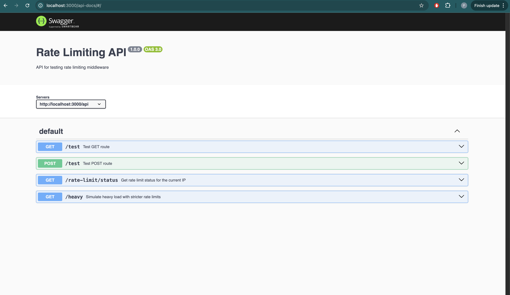

# 🚦 API Rate Limiter (Express + Redis)

A high-performance, production-ready API rate limiter built using **Express.js** and **Redis**, leveraging the **sliding window algorithm** for precise and distributed request throttling.

---
✅ Sliding Window Rate Limiting
Unlike fixed window algorithms that reset at intervals, the sliding window method continuously evaluates requests within a time frame for more accurate limiting.

🔁 Redis-backed
Redis enables shared rate limit tracking across multiple servers, making the system scalable and suitable for distributed deployments.

⚙️ Customizable
Rate limits like request count and time window can be easily configured globally or per route to suit different API requirements.

🛡️ Production Ready
Includes robust error handling, request logging, and clean failure responses to ensure stability in production environments.

📐 Clean Architecture
The codebase follows SOLID principles and separates responsibilities clearly, making it easy to maintain and extend.

---

## 🚀 Quick Start

### ✅ Prerequisites

- Node.js v18 or higher
- Redis installed and running locally

### 🔧 Installation & Running

```bash
# Clone the repository
git clone https://github.com/prajwal9773/API_RATE_LIMITER.git
cd API_RATE_LIMITER

# Install dependencies
npm install


# Start Redis server if not already running
redis-server

# Start the application in development mode
npm run dev

📡 API Endpoints


```
| Method | Endpoint                 | Description                        |
| ------ | ------------------------ | ---------------------------------- |
| GET    | `/health`                | Health check                       |
| GET    | `/api/test`              | Basic test endpoint (rate limited) |
| POST   | `/api/test`              | POST variant (rate limited)        |
| GET    | `/api/rate-limit/status` | Check current rate limit status    |
| GET    | `/api/heavy`             | Endpoint with stricter limits      |


📘 Swagger Documentation

Swagger UI available at:

GET /api-docs
Swagger configuration is defined in src/docs/swagger.js. You can use it to test all API endpoints directly in the browser




# 🧱 Architecture Overview

🔌 Core Components
RateLimiter Service
Implements sliding window algorithm with Redis sorted sets.
Rate Limit Middleware
Express middleware that applies rate limits to API routes.
Redis Client
Manages Redis connections with auto-reconnect logic.
Logger
Outputs structured logs (JSON format) for observability.
Error Handler
Catches and formats errors for client responses.

# 📐 Design Principles

Single Responsibility – Each module handles one concern

Open/Closed – Easy to extend with new strategies

Dependency Injection – Services are passed, not hardcoded

Interface Segregation – Small, focused modules

Separation of Concerns – Clear boundaries between logic layers


# ⚡ Performance Optimizations

✅ Uses Redis ZSETs for efficient O(log N) operations

✅ Atomic operations with Redis transactions

✅ Fail-open strategy to keep app running if Redis is down

✅ Expired entry cleanup for optimized memory use

✅ Efficient IP tracking using IP + timestamp logic


